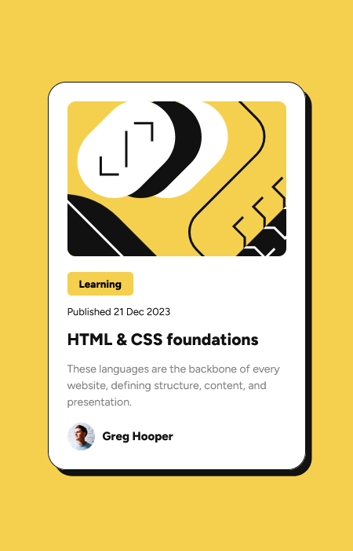
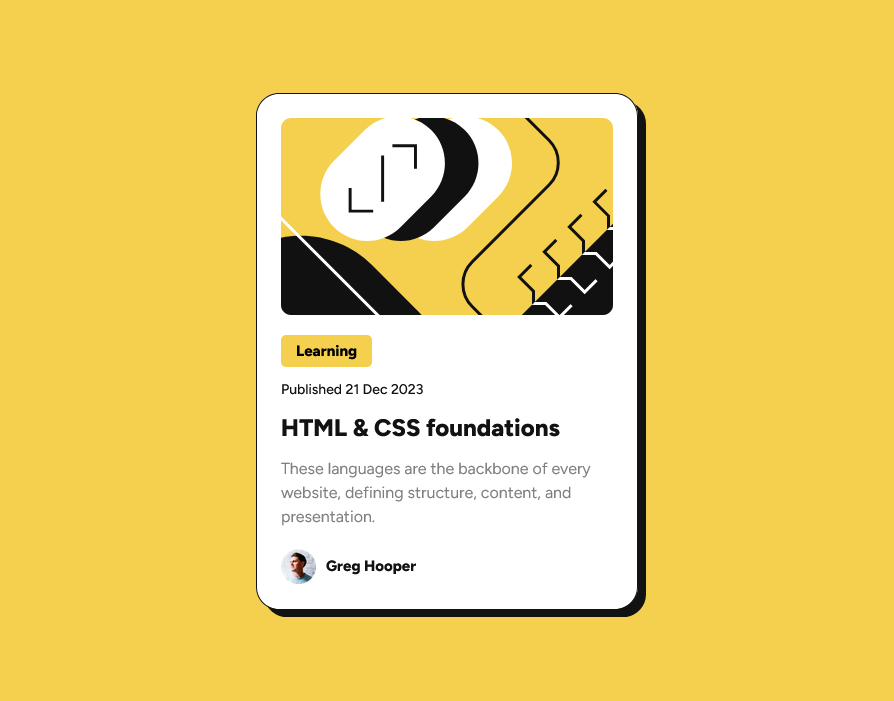

## Overview
This is my solution for front-end mentor challenge name: [Blog preview card challenge](https://www.frontendmentor.io/challenges/blog-preview-card-ckPaj01IcS)

### Screenshot
Mobile view\

desktop view\

### Demo
[Click me](https://wajidkhan2-frontendmentor-challenges.github.io/Blog-preview-card-challenge-fm-html-css/)

### Built with
- Mobile-first workflow
- Semantic HTML5 markup
- CSS custom properties

### What I learned
    I learned about css positions [relative, absolute]

### Useful resources
- [centre-crop-thumbnails-with-css](https://jonathannicol.com/blog/2014/06/16/centre-crop-thumbnails-with-css/) - for croping img with divs

### Coded by
- [wajidkhan2](https://github.com/wajidkhan2)
- [repo url](https://github.com/wajidkhan2-frontendmentor-challenges/Blog-preview-card-challenge-fm-html-css.git)
